# Calculus

## Motivation to Derivative
- Lets take an example of a vehicle. it starts with some speed, then it moved to higher speed, the stopped for sometime, then moved in a lowerspeed. After an hour it reached some distance. If I want to calculate **velocity** , 
    - v = $\frac{\Delta{s}}{\Delta{t}}$
    - change in distance/change in time.
- Here we are calculating velocity after an hour interval.
- But If I want to calculater velocity at any point in time instance.thats is called **instatanious velocity**
- **Derivative** is the instantaneous rate of change of a function, Here the function is dinstance and derivative is velocity.

- Suppose you have a dataset of time and the distance travelled by that time. Each time is in interval of 5 second. Can you find velocity at exactly t = 12.5 seconds.  
    - No, minimum velocity we can find is in interval of 5 seconds. 
    - We can find the average velocity from 10 to 15 seconds.

#### Slope
- at time 10 suppose the car is at 122m. then at time 15 it is at 202. Velocity is same as calculating slope on the line.
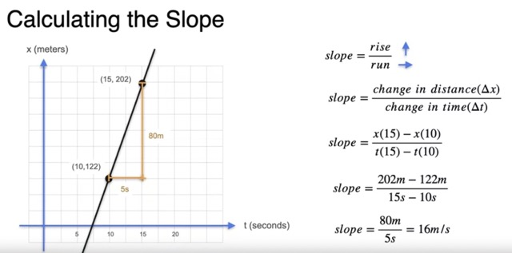

#### Derivative and tangents.
- Suppose we have a function how the car moved with respect to time. now we want to calculate what is instantaneous velocity at time 12.5.
- Lets start with  by calulating velocity between 2 points, first point is 12.5second other one is some other point. But that is not the velocity at time 12.5. 
- Lets reduce the distance. 
- 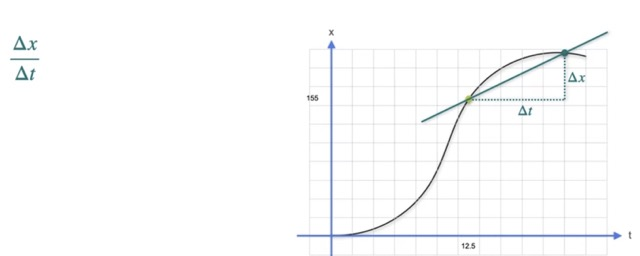
- If we reduce the distance to a very minimum, then the slope becomes tanget line.
- 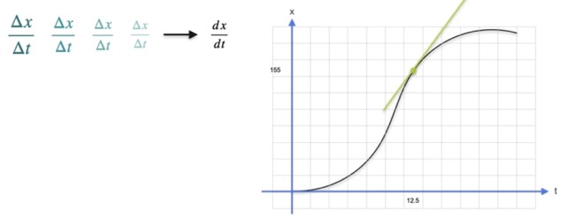
- Instantaneous rate of change is when we move atiny tiny bit of distance in tiny bit of time.
- 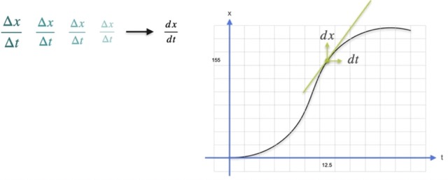

**ZeroSlope**: When the function (distance) didn't change in a tiny interval of time. thenthe slope is 0. 
- Below is a graph of a car's distance with respect ti time. At these 4 positions t = 10, t = 16, t= 22, t=34 car's velocity is 0. at that point derivative is 0 as there is no change in distance for a tiny t.
- 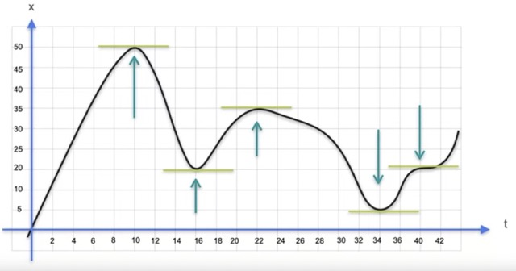
- **Maxima** is the point where car travelled to maximum distance from origin. in this example it is at t = 10.
- **Minima** is th epoint where car travelled to a minimum distance from a origin. in this example it is at t = 34.
- In any continuous function , maxima and minimam occurs at point where slope is 0. derivative is 0. 

- Graphical tool for derivative and slope: https://www.coursera.org/learn/machine-learning-calculus/ungradedWidget/CwsqD/concept-of-derivatives
- Graphical tool, approximation of derivative:  https://www.coursera.org/learn/machine-learning-calculus/supplement/AOCfq/approximation-of-derivatives

#### Notations:
- 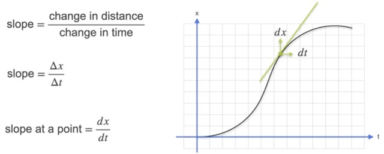
- As we always plot the graph in x and y axis. this will be 
- 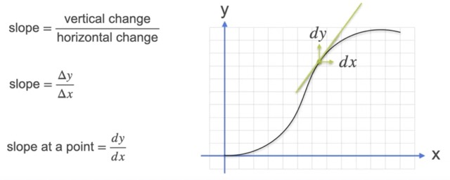
- In general we write it as a function y= f(x)
- 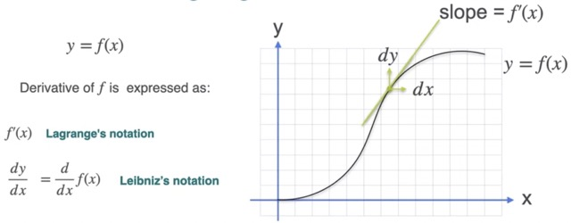

### Common derivatives
#### Derivative of a constant function.
- `y= f(x) = c`
- if it is a constant function then there is no slope at all. its derivative is 0.
- 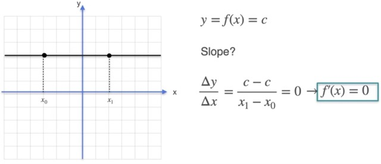
#### Derivative of a line.
- `f(x) = ax + b`
- In this case slope of the line is **a**. 
- SO the derivative at any point will become **a**.
- 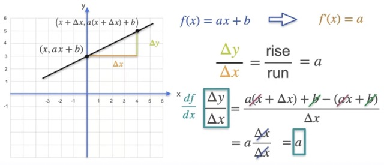

#### Derivative of Quadratic function
- y=f(x) = $x^{2}$
- Derivative is the rate of change of f for a tiny change of x.
- lets try to calulate manually the $\frac{\Delta{f}}{\Delta{x}}$ when x = 1.
- For this takes take $\Delta{x}$ starting from 1.0 to reducing it to 1/1000
- 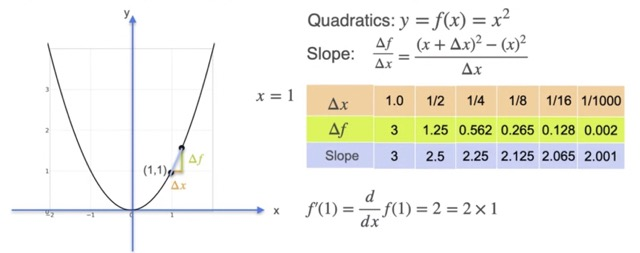
- here as we see as the change in x goes to very small. the slope is going towards 2, which is 2 * 1  that correct, derivative of f(x) = $x^{2}$   is 2x.
- 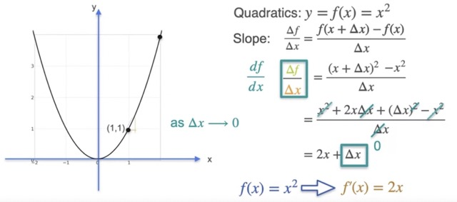

#### Derivative of Cubic function
- y=f(x) = $x^{3}$
- lets try to calulate manually the $\frac{\Delta{f}}{\Delta{x}}$ when x = 1.
- For this takes take $\Delta{x}$ starting from 1.0 to reducing it to 1/1000
- 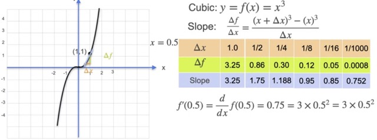
- lets calculate mathematically
- 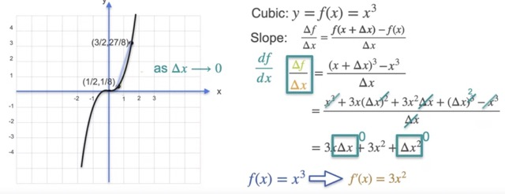
- as $\Delta{x}$  becomes very small , tends to 0. then the terms, 3x $\Delta{x}$ and $\Delta{x} ^{2}$ becomes 0. 
- derivative of f(x) = $x^{3}$ is 3 * $x^{2}$

#### Derivative of other power function
- let y=f(x) = $x^{-1}$
- Following the previous manual approach, lets find out the drivative of this function at x = 1.
- 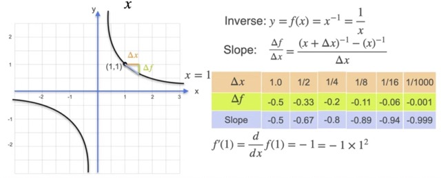 
- calculating mathematically 
-  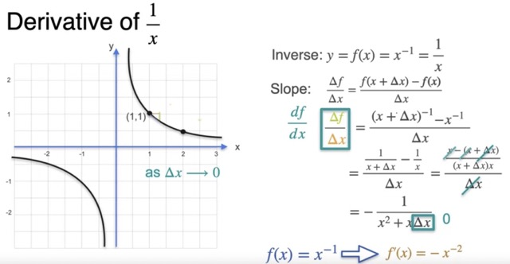 

#### Derivative of Power function
- let y=f(x) = $x^{n}$
- 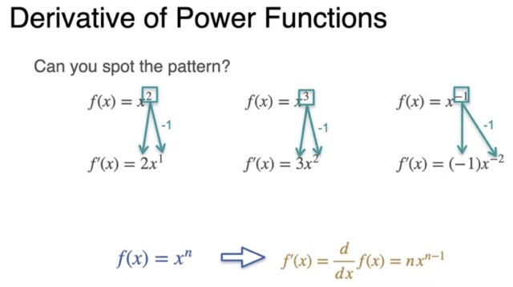 

- Graphical tool for common derivatives: https://www.coursera.org/learn/machine-learning-calculus/ungradedWidget/fwPaZ/common-derivatives

### Inverse function
- A function `g` is called inverse of a function `f` if  g (f(x)) = x
- 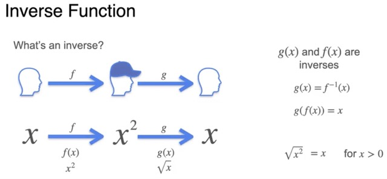
- Example: lets take a function f(x) =  $x^{2}$  and g(x) , its reverse function ,    g(x) = $\sqrt{x}$
- 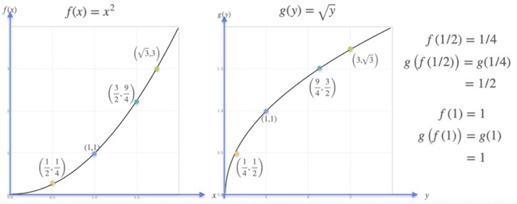
- **Derivative of the inverse function**: 
- in below example, we are trying to calculate slope at x = 1. Here we can see  $\Delta{g}$ = $\Delta{x}$  and  $\Delta{y}$ = $\Delta{f}$
- Slope of inverse function is 
-  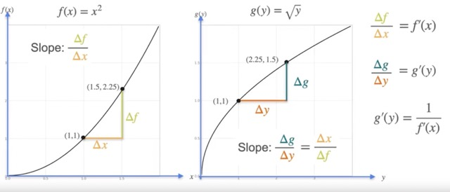 
- **Example**:
- 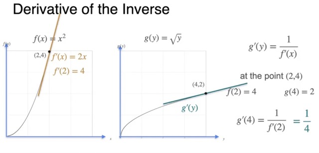 
#### Derivative of Trigonometric function
- 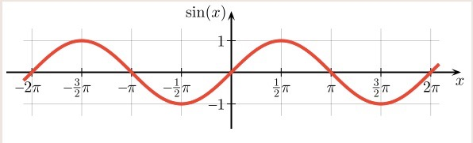
- 
- for Sin function, f(x) = sin(x)
- If we try to see the slope of Sin(x) at various points like -$\pi$,-$\pi$/2 , 0, $\pi$/2 . it is -1, 0,1,0
- If we see the value of Cos(x) at these points then we will find that value of cos(x) is exactly same as slop of sinx.
- 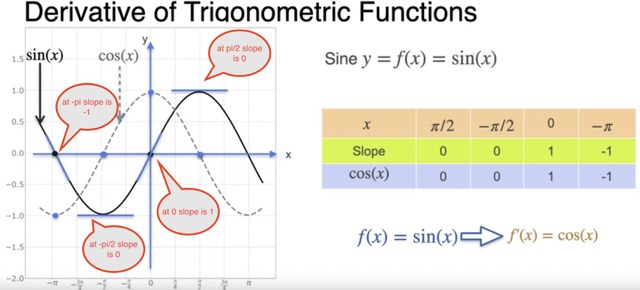
- So we can say f(x) = sinx then $\displaystyle \frac{\partial f}{\partial x}$ = cos(x)

- Simillarly f(x) = cos(x) then $\displaystyle \frac{\partial f}{\partial x}$ = -sin(x)

- 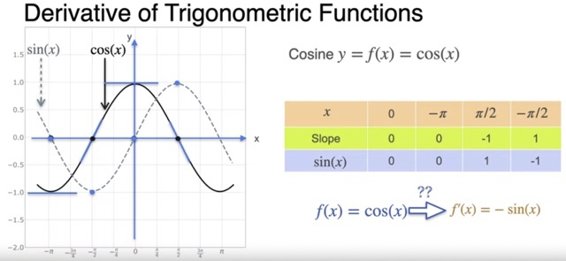
- for proof please check, https://www.coursera.org/learn/machine-learning-calculus/lecture/CcD2l/derivative-of-trigonometric-functions

### Euler's number (e)
- It is defined as (1 + 1/n)n , it is 2.718
- Its a special number if f(x) = $e^{x}$ then $\displaystyle \frac{\partial f}{\partial x}$ = $e^{x}$.
- So its derivative is itself only.

#### Understanding Euler's number
- you have $1. you have to deposit your money to bank to get intrests. among these 3 banks which one is better. and at the end of a year where your money will grow more.
- 
- lets calculate
- 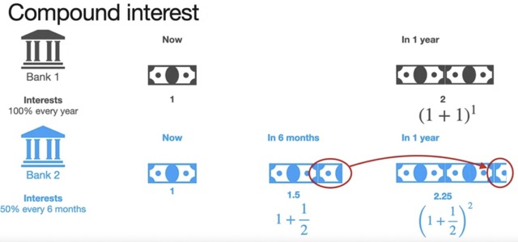
- 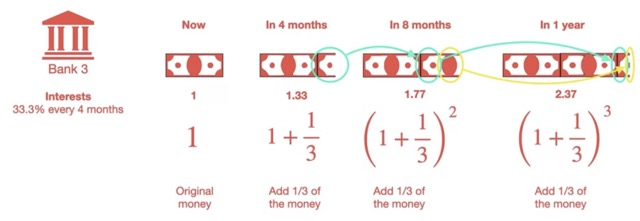

- What if a bank said if it will 1/12th of intrest for every month.
- 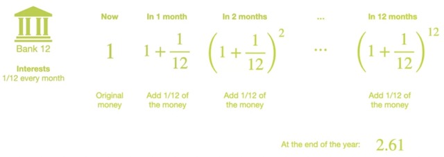
- at end of first month opur principal is (1 + $\frac{1}{12}$)
- at end of second month intrest will be 
$\frac{1}{12}$(1 +$\frac{1}{12}$).  So total principal at end of second month = (1 + $\frac{1}{12}$) + $\frac{1}{12}$(1 +$\frac{1}{12}$) =  $(1 + \frac{1}{12})^{2}$
- Like this at end of the year, it will become $(1 + \frac{1}{12})^{12}$

- Now if this interval reduced to small. with n equal intervals, then 
- 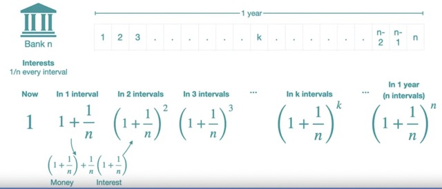

- If we reduced it to a very small number then 
- 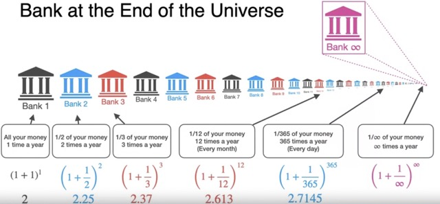

- $(1 + \frac{1}{\infty})^{\infty}$  = e = 2.718

#### Derivative of $e^{x}$
- $e^{x}$ is special, because derivative of $e^{x}$ is $e^{x}$
- 
- lets calculate manually the slope of $e^{x}$ line at x = 2.
- 

### Derivative of $\log(x)$
- $\log(x)$ is an inverse function to $e^{x}$
- i.e: $e^{log(x)}$ = $x$
- $e^{log(3)}$ = $3$
- 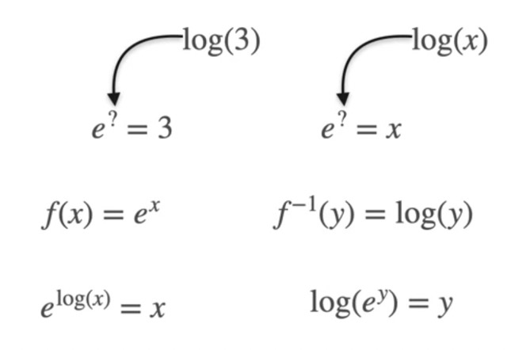
- We know derivative of f(x) = $e^{x}$ is $e^{x}$.
- Also we know that if g(x) is inverse of f(x) then derivative of g(x) = 1/ derivative of f(x)
- Applying these 2 principle we can find the derivative of f(x) = ${log(x)}$
- 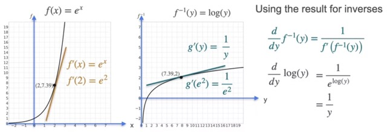

### Non-differentiable function
- For a function to be differentiable, the drivative has to exist at every point in the interval.
    -  at every point on the function curve we should be able to draw a well defined tanget line. We should be able to calculate slope at every point on the curve.
- let take another function as below. at point 0, there is no well defined tanget/slope. So at point 0 there is no derivative. 
-  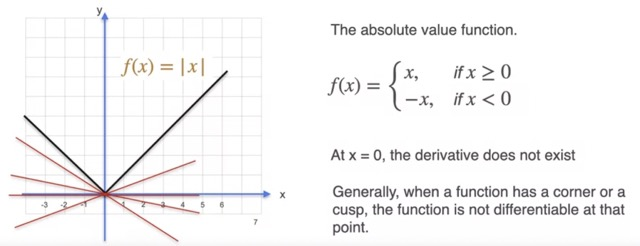
- Any function graph which look like there is a corner , doesn't have derivative.
- **Example 2** Lets take another example, the below function is not continuous. So it doesn't have derivative at -1.
-   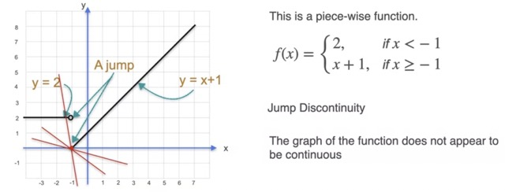
-  **Example 3** 
- In this example it seems there is tanget at every point. but at 0, tanget is y axis. So its slope will be 0. Any function which has a slope along with vertical axis is not differentiable.
-  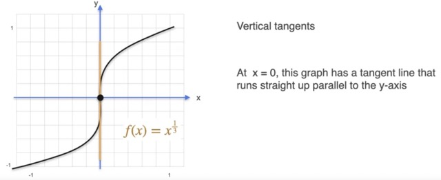
- There are 3 type of functions which are non-differentiable.
-  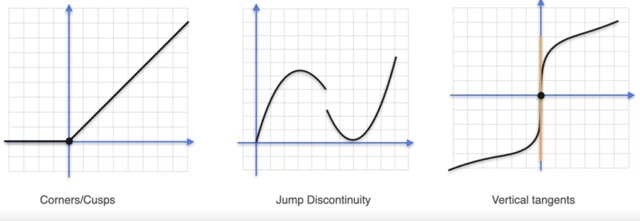

### Derivative Properties
- We learned derivative of few common functions. For derivative of complicated functions we can piggyback on derivative of common functions using derivative properties.

 #### Multiplication by a scalar
 - if f = 4 *g then  $\displaystyle \frac{\partial f}{\partial x}$ = 4 * $\displaystyle \frac{\partial g}{\partial x}$
- derivative of f(x) = x2 = 2x
- derivative of f(x) = 2 x2 = 2 * derivative of x2 = 2* 2x = 4x
-  
- another example
- 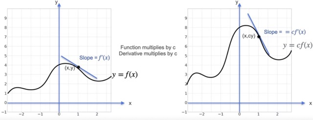 
#### Sum Rule
- if ${f(x)}$ = ${g(x)}$ + ${h(x)}$ then $\displaystyle \frac{\partial f}{\partial x}$ = $\displaystyle \frac{\partial g}{\partial x}$ + $\displaystyle \frac{\partial h}{\partial x}$

#### Product Rule
- if ${f(x)}$ = ${g(x)}$ * ${h(x)}$ then $\displaystyle \frac{\partial f}{\partial x}$ =  g * $\displaystyle \frac{\partial h}{\partial x}$  + h * $\displaystyle \frac{\partial g}{\partial x}$
- Lets calculate it by a digram,In a small time ${\Delta{t}}$  a small increment of ${\Delta{h}}$ for h also incresed by ${\Delta{g}}$ for g.
- Now as  ${f(x)}$ = ${g(x)}$ * ${h(x)}$ , derivative of  ${f(x)}$ = 
- 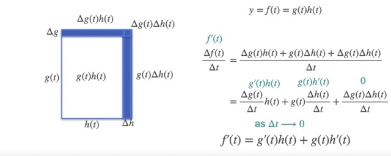 

#### Chain Rule
**Intution**: 
- 1.  Suppose we are travelling in a car towars top of a hill. So every time interval we are covering some height. So we have 2 variables here time (t) and height (h).
    - The rate of change of height at a time t = $\displaystyle \frac{\partial h}{\partial t}$ 
- 2. As height increases temperature drops. So for every unit of height increment there is drop in temperature. So we have 2 variable here height(h) and Temperature(T) . 
    - The rate of change of tempearture with respect to height = $\displaystyle \frac{\partial T}{\partial h}$

- Now if I want to calculate rate of change of temperature(T) with respect to time (t)  $\displaystyle \frac{\partial T}{\partial t}$ = $\displaystyle \frac{\partial T}{\partial h}$ * $\displaystyle \frac{\partial h}{\partial t}$
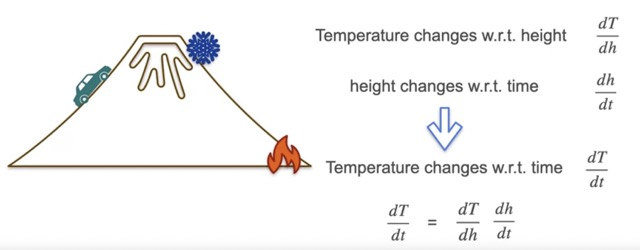
- Lets plot this initution on a graph
- 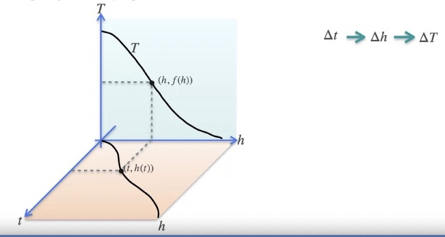
- In this case height h is a function of time t
- Temperature T is a function of height h
- at time t, we are at height h(t) at that height temperature is f(h)

- if there is a small change in time ${\Delta{t}}$ then it will result into a Small change in height ${\Delta{h}}$ which in turn result in to a small change in temperature ${\Delta{T}}$
    -  ${\Delta{t}}$ -> ${\Delta{h}}$ -> ${\Delta{T}}$
- when that change  ${\Delta{t}}$ moves very small

  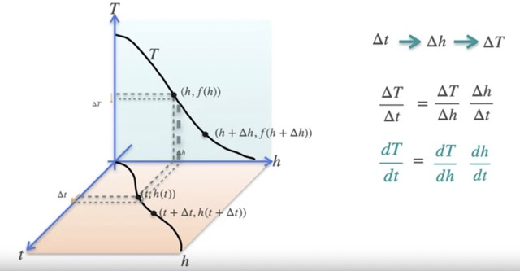 

-**Formula**:
- Like we saw above suppose we have composition function.
    - **f(t) = g(h(t))**
    - derivative of g(h(t)) = (derivative of g with respect to h ) * (derivative of h with respect to t) = $\displaystyle \frac{\partial g}{\partial h}$ * $\displaystyle \frac{\partial h}{\partial t}$

    - example: Suppose 3 composition functions.
    - **f(g(h(t)))**
    - derivative of this function also simillar, we need to apply the chain rule.
    - (derivative of f with respect to g ) * (derivative of g with respect to h ) * (derivative of h with respect to t)   = $\displaystyle \frac{\partial f}{\partial g}$ * $\displaystyle \frac{\partial g}{\partial h}$ * $\displaystyle \frac{\partial h}{\partial t}$

**Leibniz's notation**
- its easy to represent this derivative of compositions with  Leibniz's notation 
- $\displaystyle \frac{\partial f(g(h(t)))}{\partial t}$ = $\displaystyle \frac{\partial f}{\partial g}$ * $\displaystyle \frac{\partial g}{\partial h}$ * $\displaystyle \frac{\partial h}{\partial t}$

- representing the same in Lagrange's notation is little different.  

**Lagrange's notation**  
- first one is Leibniz notation, second one is Lagrange's notation 
-  

## Optimization
- Derivative is used to calculate the rate of change of function. But why do we need it in ML.
- in ML models most of the time, we are looking for maximum and minimum of the function. We know that at maximum or minimum of the function, the derivative is zero.
- Ther can be multiple minimum or multiple maximum of the graph.
- 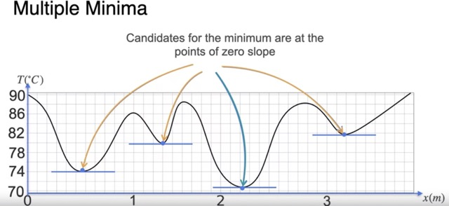 

- **Example**: 
- lets assume we have 2 powerlines. We need to connect the powerlines to a house. and the cost of connecting the powerlines to the house is the square of the distance between them.
- 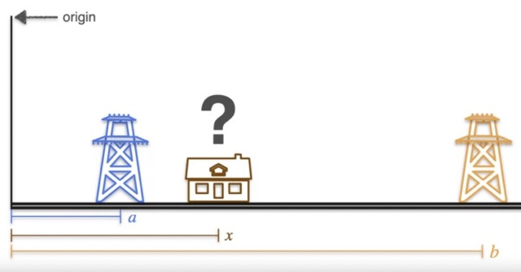
- The goal is to find the correct location for the house to minimize the cost to conenct to both powerlines.
- 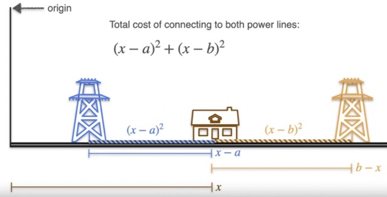
- if we visulaize the cost in terms of area, then .
- 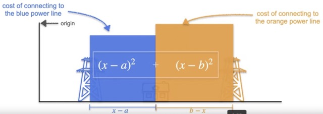
- If we put the house near Origin then cost can be visualize as
- 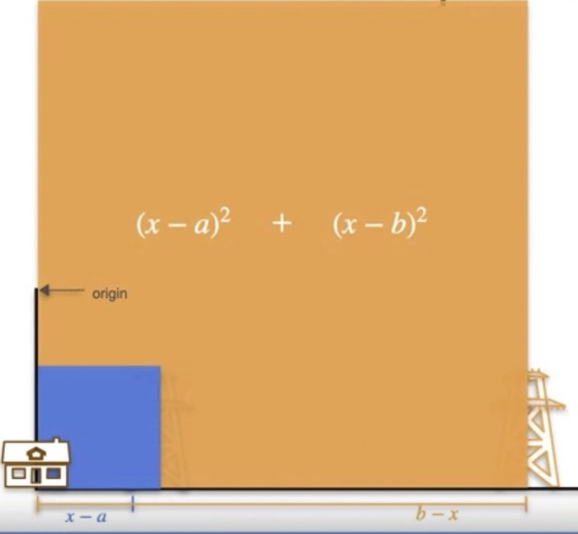
- If we put the house near the second powerline then the cost can be visualize as
- 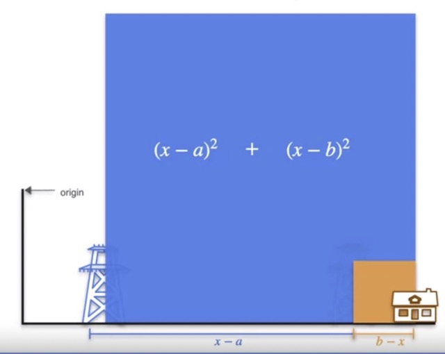
- The goal is to find the optimum place for the house to minimize the cost. SO we need to find the minimum point on the function 

    $(x-a)^{2}$ + $(x-b)^{2}$ -> where  a and b are distance of 2 powerlines from origin.
- To find minimum we need to find a point where derivative of  $(x-a)^{2}$ + $(x-b)^{2}$  is 0.
- If we solve this equation then x = (a +b ) /2
- 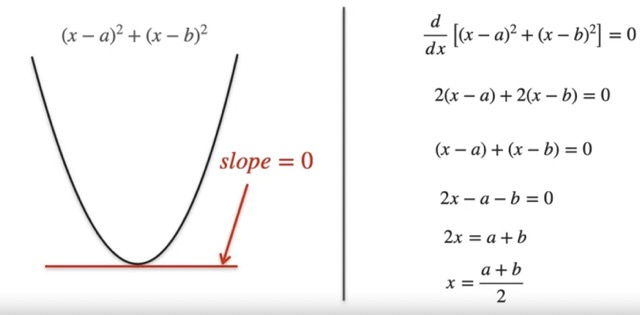   
- Simillarly if we have 3 powerlines. 
- 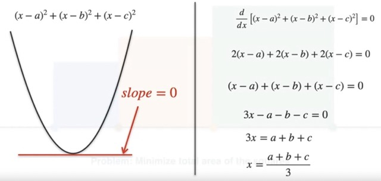
- For n powerlines
- 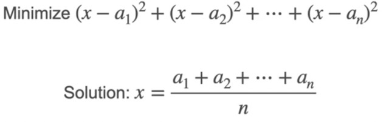

- **Square Loss** : In the above example we optimized a function where cost is a square of the distance. We were minimizing that cost.

- ### Log Loss
- **Example**: Suppose we have 3 coins, , 
    - Coin1 is a biased coin, It has a probability of 70% for getting head, and 30% of getting tail.
    - Coin2 is a fair coin, It has a probability of 50% for getting head, and 50% of getting tail. 
    - Coin3 is a biased coin, It has a probability of 30% for getting head, and 70% of getting tail.  
    - Our goal is to get 7 heads in a 10 coin toss. What is the best coin to achieve this.
    - Lets say probability of a coins toss to be head is $p$, then for tail it will be $1-p$.
    - the above statement can be written as  $p^{7}$ $(1-p)^{3}$ = g(p), now the goal is to maximize g(p).
    - To find the maximum point we know that $\displaystyle \frac{\partial g}{\partial p}$ = 0
    - Solving this equation we got $p^{6}$ $(1-p)^{2}$ $(7-10p)$ = 0 . to find p we need to find any one of these 3 terms are zero.
        - if $p^{6}$ = 0, then its always tail, there is no head. So its not a possible solution.
        - if $(1-p)$ = 0 then its $p$ =1 its always head, we will not get any tail here. So its not a possibel solution.
        - if $(7-10p)$ = 0 then p = 0.7. So the best possible coin is the coin which has probability to get a head os 0.7 to maximize our use case.
    - 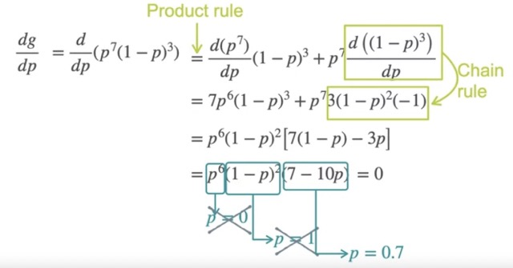

    - **Note**:
        -  Product rule:  ${f(x)}$ = ${g(x)}$ * ${h(x)}$ then $\displaystyle \frac{\partial f}{\partial x}$ =  g * $\displaystyle \frac{\partial h}{\partial x}$  + h * $\displaystyle \frac{\partial g}{\partial x}$
        - Calculate:  $\displaystyle \frac{\partial (1-p)^{3}}{\partial p}$
            - let $u$ = 1-p
            - So the above equation can be written as $\displaystyle \frac{\partial u^{3}}{\partial p}$ 
            - By chain rule: $\displaystyle \frac{\partial u^{3}}{\partial p}$  = $\displaystyle \frac{\partial u ^{3}}{\partial u}$ * $\displaystyle \frac{\partial u }{\partial p}$
            - = $3u^{2}$ * $\displaystyle \frac{\partial u }{\partial p}$
            - = $3(1-p)^{2}$ * $\displaystyle \frac{\partial (1-p) }{\partial p}$
            - = $3(1-p)^{2}$ * $(-1)$
    
- If you see this derivative quite complicated. It will beocme more complicated as the number of term grows.
- **Another approach**: 
    - Here we are trying to maximize the a function g(p) = $p^{7}$ $(1-p)^{3}$. 
    - If at any point g(p) is maximum then at that point $log(g(p))$ also maximum.
    - So instead of solving  $\displaystyle \frac{\partial p^{7}(1-p)^{3}}{\partial p}$ we can solve $\displaystyle \frac{\partial log(p^{7}(1-p)^{3})}{\partial p}$
    - $log(p^{7}(1-p)^{3})$ = $7log(p)$ + $3log(1-p)$
    - And we know $\displaystyle \frac{\partial log(p)}{\partial p}$ = $ \frac{1}{p}$
    - 
    - in ML many we will calculate log of the probability in many use cases.
    - in this approach we applied log as a cost function, this is called log loss function.
    #### Why Log loss function
    - If we have a situation where we need to calculate derivative of a product. most of the time derivative of product becomes more complicated. log of the product converts tpo a sum of log of individual terms.
    - **Derivative of product is hard, derivative of sum is easy.**
   
    - **Product of lot of tiny things are tiny**. If our ML model we have tiny probabilities like 0.00000023 then multiplying them will generate very tiny number. Computer's can't handle very tiny numbers.
    - But log of a tiny number is a big negative number. computer can handle that well. 

# Week2- Gradients
### Tangent Plane
- When we plot a function with one variable like $f(x) $ = $x^{2}$, we can draw it in a 2d plane, y=  $x^{2}$ . And the derivative at any point is the slope of tangent line at that point.
- If we have two variables  like $f(x,y) $ = $x^{2}$ + $y^{2}$, then it will be drawn as a 3d space. Instead of tangent line, we will have tangent plane.

### Finding tangent plane
- Suppose we want to find the tangent plane at x= 2, y=4
- fix y=4, and find the tangent line at $f(x,4) $
- fix x =2 and find the tangent line at $f(2,y) $
- Then we can find the plane which contains these 2 tangent lines.

 

## Partial derivative
### intution

- if we have function of 2 variables, then We need to find the tangent plane. So do that we need to find the tangent line with respect each variable.
- Fix one variable, visually it means, that variable doesn't matter. So we can cut the graph in that variable side, then it will become an 1d graph. here we can find the tangent line.
- Finding the slope of tangent line with respect to one variable and making all other variable constant is called Partial derivative with respect to that variable.

 

 

### Partial derivative

- Steps for partial derivative
 

- example: 
- let $f(x,y) $ = $3x^{2}$ $y^{3}$
- to calucltae partial derivative with respect to x, we need to consider all other variable as constant. here $y^{3}$ will be treated as constant. 
- $\displaystyle \frac{\partial f}{\partial x}$ = $3 * (2x)$ $y^{3}$ = $6xy^{3}$
- to calucltae partial derivative with respect to y, we need to consider all other variable as constant. here $3x^{2}$ will be treated as constant. 
- $\displaystyle \frac{\partial f}{\partial y}$ = $3x^{2}$  $3y^{2}$ = $9x^{2}y^{2}$

### Gradient ($\nabla $)
- Its the vectors where each entry is the partial derivative with respect to each variable. represented by symbol $\nabla $

- **Finding maxima/minima in a function of 2 variables**
- It is Simillar to function of single variable, where we solve the equation $\displaystyle \frac{\partial f}{\partial x}$  = 0
- In case of 2 variables, we need to find partial derivative with respect to  each variable, each of theses partial derivative must be 0 for maxima or minima. then we need to solve the system of lenear equation to find 2 variables.

- Example:
- We have a function of 2 variable x, y. We need to find the minima in that function.
- Calculate partial derivative with respect to  each variable, an da point to be minima or maxima , derivative at that point must be 0.  then solve the equation.
- $\displaystyle \frac{\partial f}{\partial x}$ =  $ \frac{-1}{90} x (3x-12)y^{2}(y-6)$ = 0. to make this equation 0, any one term among these 4 is 0.
- Simillarly $\displaystyle \frac{\partial f}{\partial y}$ =  $ \frac{-1}{90} x^{2} (x-6)y(3y-12)$ = 0

- These 2 equation gave us a lot of points where derivative is zero. It can be maxima or minima. So we need to analyze and identify the minima .
- 

## Gradient Descent
- Sometime solving this way by taking partial derivative is too complicated, mostly when the number of variable increases.
- Gradient descent is another iterative approach to find the minima/maxima of a complicated multi variable function. 

- **Approach**:
- Start from any point, and check the slope at that point (by taking derivative at that point) . based on the slope move starting point.

- Sometime slope can be too steep, because of that our iterative step will move a big step. which will be too chaotic. We need to control the rate of this iterative movement.
- So in that case instead of moving the starting point using slope, we need to multiply slope with a small variable called leraning rate.
-  
- As the learning rate is small constant like 0.01. if slope is higher it will move the starting point relative higher than in case of less slope.
 

- Example

